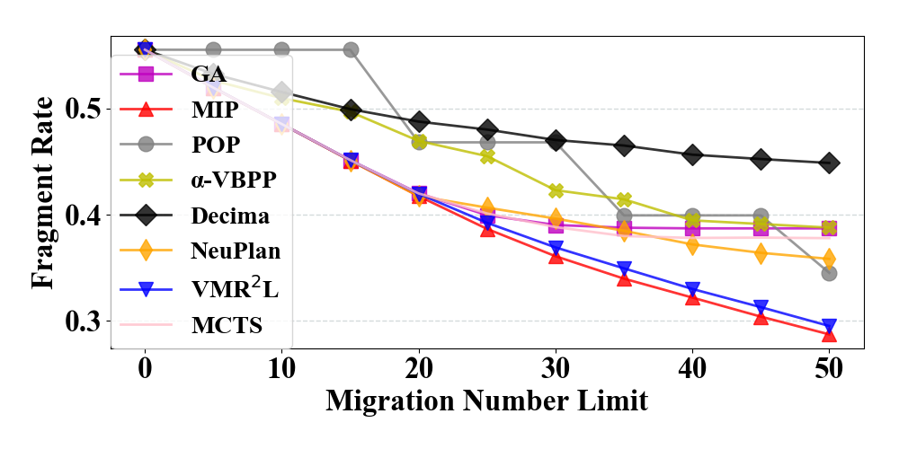
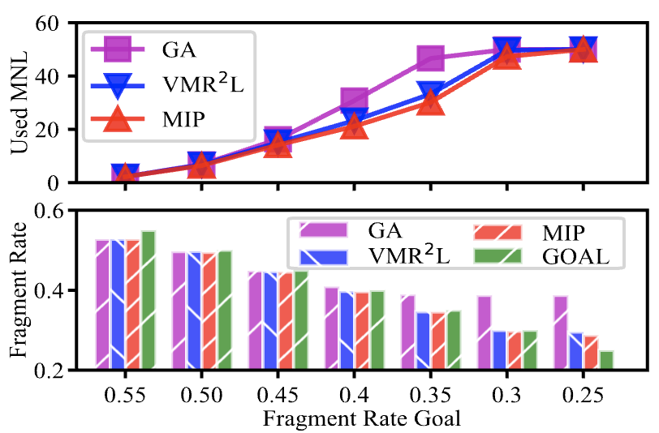

## 	VMR2L: Virtual Machines Rescheduling Using Reinforcement Learning in Data Centers

### A better formatted PDF of our paper is available here! [./readme-figures/nsdi24.pdf](./readme-figures/nsdi24.pdf)!

### Background
Current industry-scale data centers receive thousands of virtual machine (VM) requests per minute. Heuristic algorithms
are used to allocate these requests in real time to different Physical Machines (PMs). 

<div align="center">
  

Virtual Machine initial scheduling requires a latency level that can only be handled by heuristic algorithms,
but this results in many fragments due to their simplicities and the dynamic creation and release of VMs.
</div>

<div align="center">
  

Virual Machine rescheduling is typically done during off-peak hours when the required level of latency
is more lenient. However, it still requires the model to process around 1 query per second. Failure to meet this latency requirement can result in many illegal actions!
</div>

<div align="center">
  

Virual Machine rescheduling reassigns a VM that is already deployed onto a new PM destination.

</div>

<div align="center">
  
A visualization of the learned rescheduling policy. It can be generated using eval_plot_steps.py (see below).
</div>

**Why RL?** 

-  Supervised learning requires many correct labels, but they are expensive to obtain and requires
the model to output all rescheduling actions at once, which causes the output space to explode.
-  Heuristic models require manual feature engineering if the data distrition changes.
-  Search-based and exact models are slow at inference time.
-  Deep RL extracts features automatically. More importantly, we can cheaply simulate the reschedling
actions as there are no environment uncertainties! This means we can let our agent cheaply interact with
the environment as much as it wants.

### Model Details
<div align="center">
  
</div>

**Two-Stage Agent.** 

- We let the model make one rescheduling decision that reschedules one VM at each time step. <br>
For example, if the model is allowed to reschedule 50 VMs, we let the model take 50 actions.

- At each time step, the action is a two-tuple -- the VM to be rescheduled and its new destination PM.
We design a two-stage agent, where the model chooses the VM in the first stage and then selects a destination
PM in the second stage.

- Benefits are: i) once a VM is selected, we can mask out all the illegal PMs in order
to satisfy various service constraints (e.g., resource availble, affinity level), ii) it allows
field experts to inject domain knowledge on which VMs should be rescheduled into the model.

<div align="center">
  
</div>

**Feature Extraction with Sparse-Attention.** 
- We use an attention-based model as the backbone as 
its number of learnable parameters is independent of the number of VMs and PMs. 

- We design a tree-level *sparse-attention* module to allow each VM/PM to exchange information
with other machines under the same PM. This affliation information is critical for VM rescheduling
but is absent in vanilla attention.

<div align="center">
  
  
</div>

**Risk-Seeking Evaluation.**

- (Left) Since we can exactly simulate the effect of VMR actions, we can sample multiple trajectories 
during inference time, and only deploy the one with the highest reward.
- (Right) Actions with low probabilities are likely to be suboptimal, and we should avoid them during inference!

### Experiments
<div align="center">
  
  

VMR2L beats all baselines with the one-second latency constraint.
</div>

<div align="center">
  
  

(Left) Sparse-attention is able to extract finer relational information and thus achieves better FR. <br>
(Right) Even knowledge distillation from a greedy heuristic model allows VMR2L to converge faster.
</div>

<div align="center">
  
  

Two-stage design allows VMR2L to handle *different constraints* (service affinity is not shown here 
and can be found in the paper.)
</div>


<div align="center">
  

VMR2L can generalize to different objectives, such as reaching a FR level with the minimal number of
migration steps.
</div>


<div align="center">

  
  

VMR2L can generalize to abnormal workload levels. Even when some workload levels are not present
during training, as long as we have trained on a higher workload (or preferably a lower one too),
we can cover those gaps!
</div>

### Installation Instructions

1. Install conda:

```
$ conda create -n vm python=3.7
$ conda activate vm
```

2. rllib:

```
$ pip install gym==0.23.1
$ pip install "ray[rllib]" tensorflow torch
$ pip install -e gym-reschdule_combination
$ pip install tqdm matplotlib pandas wandb
```

3. Obtain datasets from [Google Drive](https://drive.google.com/drive/folders/1sCK9g_vldbaaOGGFPGJ8ztK4tTFwwTH5?usp=sharing).
Unzip them under ./data/flex_vm_dataset.

4. Optional:
```
$ conda install -c dglteam dgl-cuda11.3
```

### Run instructions

- To train base VMR2L, see a list of environments under 'Environments':
```
$ python3 main.py --gym-id generalizer-v2 --vm-data-size [M/multi/M_small/M_medium]
```
- To train VMR2L with ultra attention:
```
$ python3 ultra-attn.py --gym-id graph-v2 --vm-data-size [M/multi/M_small/M_medium]
```
- To use wandb, first get your [API key](https://wandb.ai/authorize) from wandb and then add an additional --track argument:
```
$ wandb login
$ python3 main.py --track
```
- Evaluation
```
$ python3 eval.py --restore-name [] --restore-file [best/latest]
```
- To visualize the migration actions, run the command below and find your *.gif's under ./runs/[restore-name]
```
$ python3 eval_plot_steps.py --restore-name [] --restore-file [best/latest] --gym-id generalizer-v3
```
- We included some trained weights, so you can directly evaluate/visualize them. For sparse-attention,
```
$ python3 eval_sparse.py --restore-name sparse --restore-file best --gym-id graph-v2
```
For base models,
```
$ python3 eval.py --restore-name base --restore-file best --gym-id generalizer-v2
```

### Environments
* generalizer-v2: Base version.
* generalizer-v2: Base version + additional details for plots.
* affinity-v0: Consider constraints in the form of service anti-affinity.
* graph-v2: Sparse attention version.
* penalty_v0: penalize illegal actions instead of masking for models without sparse attention.
